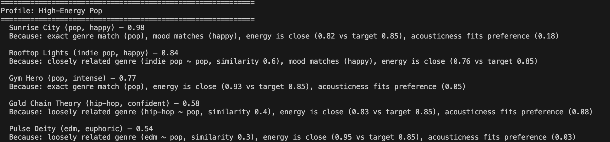
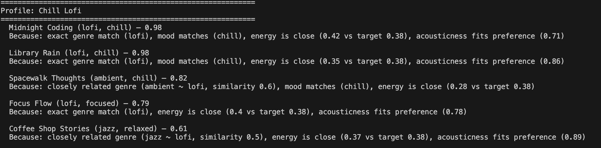
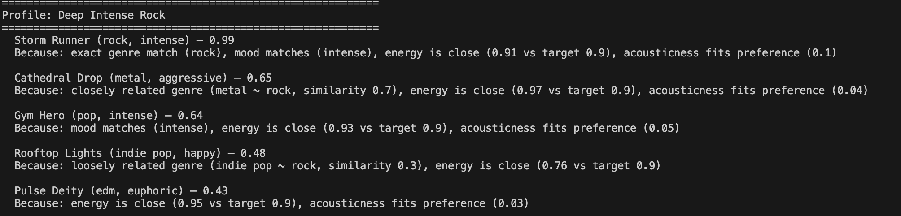
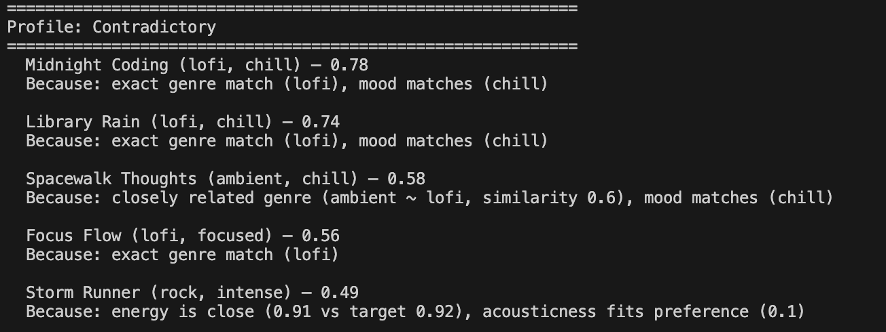
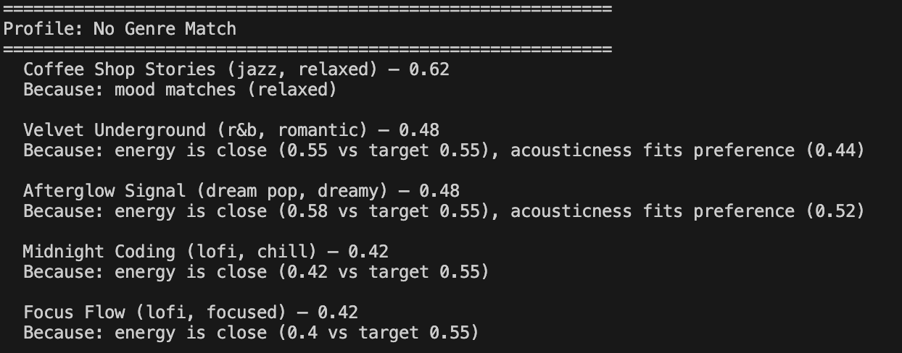

# 🎵 Music Recommender Simulation

## Project Summary

In this project you will build and explain a small music recommender system.

Your goal is to:

- Represent songs and a user "taste profile" as data
- Design a scoring rule that turns that data into recommendations
- Evaluate what your system gets right and wrong
- Reflect on how this mirrors real world AI recommenders

Replace this paragraph with your own summary of what your version does.

---

## How The System Works

This system uses **content-based filtering** — it compares song attributes directly against a user's declared taste preferences to produce a ranked list of recommendations. It does not use other users' behavior.

Each song will include genre, mood, energy, acousticness, valence, and tempo. To my knowledge, real-world recommendation systems use a combination of song-based attributes, and collaborative filtering. By recognizing specific values that resonate with a user, as well as songs that other users with similar taste enjoy, recommendation systems are able to provide better recommendations.

**Song features:**
- `genre` — categorical label (e.g. hip-hop, folk, edm)
- `mood` — categorical label (e.g. happy, melancholic, aggressive)
- `energy` — float 0.0–1.0, how intense the track feels
- `acousticness` — float 0.0–1.0, acoustic vs. electronic
- `valence` — float 0.0–1.0, emotional positivity
- `tempo_bpm` — beats per minute

**UserProfile fields:**
- `favorite_genre` — the genre the user prefers most
- `favorite_mood` — the mood the user prefers most
- `target_energy` — the energy level the user wants songs close to
- `likes_acoustic` — boolean, whether the user prefers acoustic sounds

**How the Recommender scores each song:**

The score is a weighted sum of six sub-scores, each normalized to 0.0–1.0, divided by the maximum possible total (10.0):

| Feature | Weight | Method |
|---|---|---|
| `genre` | 3.0 | 1.0 for exact match, partial credit for related genres (via similarity table), 0.0 for unrelated |
| `mood` | 2.0 | 1.0 for exact match, 0.0 otherwise |
| `energy` | 2.0 | `1.0 - abs(song - user target)` |
| `acousticness` | 1.0 | `1.0 - abs(song - user target)` |
| `valence` | 1.0 | `1.0 - abs(song - user target)` |
| `tempo_bpm` | 1.0 | Normalized to 0–1 using catalog min/max, then proximity scored |

Genre uses a similarity table rather than a strict binary match so that related genres (e.g. r&b scoring 0.7 against a hip-hop preference) still contribute to the score instead of returning zero.

**How the final recommendations are chosen:**

Every song in the catalog is scored independently. All scores are then sorted highest to lowest and the top `k` songs are returned (default k=5). The scoring rule answers "how well does this song fit?" for one song at a time; the ranking step answers "compared to everything else, which songs fit best?"

See the flowchart for a visual overview: [flowchart.mmd](flowchart.mmd)

**Algorithm recipe and known biases:**

The recommender loads every song from `data/songs.csv` and scores each one against the user's taste profile by computing six sub-scores — genre similarity (exact match = 1.0, related = partial credit via lookup table, unrelated = 0.0), mood match (1.0 or 0.0), and four proximity scores using `1.0 - |song_value - user_target|` for energy, acousticness, valence, and tempo (tempo is first normalized to 0–1 using catalog min/max). Each sub-score is multiplied by its weight (genre 3.0, mood 2.0, energy 2.0, acousticness 1.0, valence 1.0, tempo 1.0), summed, and divided by 10.0 to produce a final score between 0.0 and 1.0. Songs are then sorted highest to lowest and the top `k` are returned. The main biases to be aware of are that genre carries 30% of the total score so users with niche or unrepresented genres are disadvantaged, the similarity table encodes subjective genre-relationship judgments that may not reflect all listeners, and the small catalog means genres with more songs have a structural advantage in numeric scoring.

---

## Getting Started

### Setup

1. Create a virtual environment (optional but recommended):

   ```bash
   python -m venv .venv
   source .venv/bin/activate      # Mac or Linux
   .venv\Scripts\activate         # Windows

2. Install dependencies

```bash
pip install -r requirements.txt
```

3. Run the app:

```bash
python -m src.main
```

### Running Tests

Run the starter tests with:

```bash
pytest
```

You can add more tests in `tests/test_recommender.py`.

---

## Experiments You Tried

Six user profiles are defined in `src/main.py` and run automatically when you execute the app. Each is designed to test a different aspect of the scoring logic.

**Standard profiles** — test normal expected behavior:

| Profile | Genre | Mood | Energy | Intent |
|---|---|---|---|---|
| High-Energy Pop | pop | happy | 0.85 | Clear genre match, many candidate songs |
| Chill Lofi | lofi | chill | 0.38 | Low energy, high acoustic — should surface lofi and ambient |
| Deep Intense Rock | rock | intense | 0.90 | High energy, low acoustic, fast tempo |

**Adversarial / edge case profiles** — designed to expose weaknesses or unexpected behavior:

| Profile | What it tests |
|---|---|
| Contradictory | Genre/mood say "lofi, chill" but energy/tempo say loud and fast — do numeric features override categoricals? |
| No Genre Match | Genre set to "reggae" (not in catalog) — forces ranking on numeric features alone with no genre contribution |
| All Middle | Every numeric value at 0.5 — does the system collapse into near-identical scores, or do categorical matches still separate results? |

---







## Limitations and Risks

Summarize some limitations of your recommender.

Examples:

- It only works on a tiny catalog
- It does not understand lyrics or language
- It might over favor one genre or mood

You will go deeper on this in your model card.

---

## Reflection

Read and complete `model_card.md`:

[**Model Card**](model_card.md)

Write 1 to 2 paragraphs here about what you learned:

- about how recommenders turn data into predictions
- about where bias or unfairness could show up in systems like this


---

## 7. `model_card_template.md`

Combines reflection and model card framing from the Module 3 guidance. :contentReference[oaicite:2]{index=2}  

```markdown
# 🎧 Model Card - Music Recommender Simulation

## 1. Model Name

Give your recommender a name, for example:

> VibeFinder 1.0

---

## 2. Intended Use

- What is this system trying to do
- Who is it for

Example:

> This model suggests 3 to 5 songs from a small catalog based on a user's preferred genre, mood, and energy level. It is for classroom exploration only, not for real users.

---

## 3. How It Works (Short Explanation)

Describe your scoring logic in plain language.

- What features of each song does it consider
- What information about the user does it use
- How does it turn those into a number

Try to avoid code in this section, treat it like an explanation to a non programmer.

---

## 4. Data

Describe your dataset.

- How many songs are in `data/songs.csv`
- Did you add or remove any songs
- What kinds of genres or moods are represented
- Whose taste does this data mostly reflect

---

## 5. Strengths

Where does your recommender work well

You can think about:
- Situations where the top results "felt right"
- Particular user profiles it served well
- Simplicity or transparency benefits

---

## 6. Limitations and Bias

Where does your recommender struggle

Some prompts:
- Does it ignore some genres or moods
- Does it treat all users as if they have the same taste shape
- Is it biased toward high energy or one genre by default
- How could this be unfair if used in a real product

---

## 7. Evaluation

How did you check your system

Examples:
- You tried multiple user profiles and wrote down whether the results matched your expectations
- You compared your simulation to what a real app like Spotify or YouTube tends to recommend
- You wrote tests for your scoring logic

You do not need a numeric metric, but if you used one, explain what it measures.

---

## 8. Future Work

If you had more time, how would you improve this recommender

Examples:

- Add support for multiple users and "group vibe" recommendations
- Balance diversity of songs instead of always picking the closest match
- Use more features, like tempo ranges or lyric themes

---

## 9. Personal Reflection

A few sentences about what you learned:

- What surprised you about how your system behaved
- How did building this change how you think about real music recommenders
- Where do you think human judgment still matters, even if the model seems "smart"

